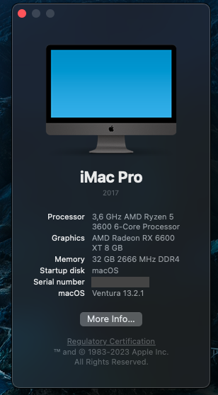

# Ryzentosh - Hackintosh with AMD Ryzen

This is quick summary of my hackintosh with AMD system & [OpenCore](https://dortania.github.io/OpenCore-Install-Guide).

I've got bored of Linux & Windows and decided to try hackintosh. Now it's been a year (since 2022 March) since it's my daily OS. I still dual-boot Windows 11.

You should read [Dortania's OpenCore](https://dortania.github.io/OpenCore-Install-Guide) install guide.

## Hardware

- AMD Ryzen 3600 no OC
- ASUS A320M-K
- Crucial 2x16GB DDR4 2666MHz
- Samsung NVME SSD 970 EVO 250GB
- AMD Radeon RX 6600 XT

## What is working

I think almost everything what I need. Also stuff like:

- GPU acceleration
- Sleep
- Bluetooth
- ...

## What is not working

Virtualization. That is VirtualBox/VMware/Docker/etc, because they use Hypervisor API which is Intel VT-x - obviously, since Apple never used AMD CPUs.

But since it's UNIX and with a help of [Brew](https://brew.sh), I never (yet) found the need for virtualization.

Need `dd`? Not a problem. [Fish Shell](https://formulae.brew.sh/formula/fish)? Sure! [SpaceShip](https://formulae.brew.sh/formula/spaceship) prompt? You got it.

I can build Linux kernels, OpenWrt, etc... With GNU [coreutils](https://formulae.brew.sh/formula/coreutils).

## Notes

It was actually quite easy to make AMD hackintosh, probably it is easier than with Intel system.

I never had any OS crashes, except some apps, but that happens rarely. I never got an update which bricked my system, yet.

I use [OCAT](https://github.com/ic005k/OCAuxiliaryTools) to sync OpenCore, drivers, kernel modules.

There's nothing much else to say, essentially this is a backup for me - for my EFI partition.